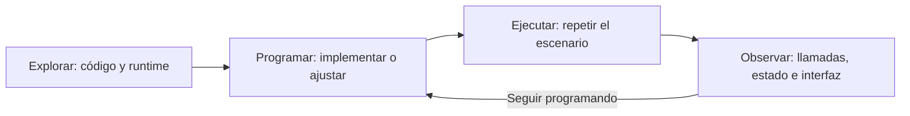

# Mobile Easy Use

**Una herramienta para desarrolladores de Android e iOS que da a los agentes de IA acceso al runtime para explorar, depurar y ejecutar pruebas UI automatizadas.**

Documentación: [English](../README.md) · [简体中文](./README.zh.md) · [Français](./README.fr.md) · [Русский](./README.ru.md) · **Español** · [العربية](./README.ar.md)

En comparación con el desarrollo web, es más difícil inspeccionar los datos internos, el estado de negocio y la ejecución de una aplicación móvil. **«La solicitud se completó, ¿por qué no se actualizó la lista?»** Este tipo de problema depende de los datos, el estado y los tiempos reales del dispositivo, que el análisis estático del código fuente no siempre puede explicar.

Mobile Easy Use proporciona a los agentes de IA acceso al runtime mediante MCP. Así pueden relacionar el código fuente con el comportamiento real de la aplicación, leer objetos y estados, interceptar llamadas a métodos, cambiar temporalmente las condiciones de ejecución e interactuar con la interfaz.

https://github.com/user-attachments/assets/e956fdbf-da6a-4608-a877-11a107f70760

## Explorar el estado y el comportamiento de la aplicación



Las observaciones guían al agente durante el ciclo de desarrollo:

- **Investigación y preparación**: relacionar el código con las llamadas, los datos y el estado de la aplicación en ejecución para entender su comportamiento real.
- **Validación de una propuesta técnica**: cambiar temporalmente configuración, campos o retornos de métodos en la aplicación en ejecución, comprobar hipótesis y restaurar los valores.
- **Diagnóstico**: reproducir el problema en la aplicación y relacionar llamadas reales, cambios de estado e interfaz para localizar el fallo.
- **Después de programar**: ejecutar la aplicación modificada y repetir el escenario para verificar el resultado real. Las expectativas confirmadas pueden convertirse en pruebas de regresión.

Por ejemplo, pide al agente:

```text
Examina esta página controlada por una opción: comprueba la configuración
y la ruta de ejecución, cambia temporalmente la opción y verifica los datos
y la interfaz en ambos estados. Restáurala al terminar.
Evalúa la propuesta con las evidencias e indica qué queda sin verificar.
```

El agente puede inspeccionar la siguiente información, según la plataforma y la implementación de la aplicación:

| Información del runtime | Qué permite conocer |
| --- | --- |
| Objetos y estado de negocio | Datos, caché, configuración y cambios posteriores a una acción |
| Llamadas a métodos | Métodos ejecutados, argumentos, resultados, pilas de llamadas e hilos |
| Tiempo de ejecución y memoria | Duración de los métodos y cambios en la memoria del proceso |
| Logs de negocio | Hasta dónde avanzó la ejecución y qué indicios explican un fallo |
| Estado de la interfaz | Existencia, visibilidad, posición y propiedades de los controles |
| Capturas de pantalla | Apariencia real y cambios visuales después de una acción |
| Recursos de la aplicación | Identificadores y contenidos de recursos Android |
| Resultados y contexto del fallo | Paso del fallo, estado, logs e imágenes recopiladas |

## También para pruebas UI automatizadas

Las mismas capacidades permiten pruebas UI más profundas: hacer clic, escribir y desplazarse, y verificar **la interfaz, las capturas y el estado de negocio nativo** en una misma prueba. Al actualizar una lista, comprueba tanto lo mostrado como los datos internos. Los cambios temporales preparan las condiciones de prueba; las observaciones ayudan a explicar los fallos.

Comparación con pruebas centradas en interacciones y aserciones de interfaz:

| Tarea | Pruebas centradas en UI | Mobile Easy Use |
| --- | --- | --- |
| Verificar el resultado | Comprobar textos, controles y capturas | Comprobar también objetos nativos, caché y estado de negocio tras la misma acción |
| Verificar estados intermedios | Esperar cambios visibles | Leer el estado interno y comprobar transiciones: cargando, pendiente o completado |
| Preparar un escenario | Usar pasos de UI y datos disponibles | Sustituir también campos o retornos de métodos temporalmente para activar una rama |
| Analizar un fallo | Revisar aserciones, capturas y logs disponibles | Relacionar también llamadas, argumentos, retornos y cambios de estado para explicar el fallo |

### Ejemplo: un clic, tres niveles de verificación

En la página inicial **UI → Class names and subclasses** de Android ApiDemo, pulsar `FIRST` debe dejar el contador en 1 y mostrar `FIRST:1`. Antes de cada ejecución, abre esa página en su estado inicial y prepara una captura de referencia revisada, posterior al clic, en `baselines/first-clicked.jpg`, ruta relativa al archivo de prueba.

Consulta los [tests Android](../fixtures/android/ApiDemo/tests/) e [iOS](../fixtures/ios/ApiDemo/tests/) para ver escenarios completos con limpieza. Para comparar la ventana, usa `expect().toHaveWindowScreenShot(...)`.

```javascript
const { describe, test, expect, run } = Test.create();
export { run };

describe('Counter button', () => {
  test('updates state, UI, and appearance', async () => {
    const button = R.id.api_ui_class_first;
    const clicked = await AndroidExp.runOnMainThread(() => AndroidExp.input.click(button));
    expect(clicked.ok).toBe(true);

    // Estado de la interfaz
    await expect(button).toBeVisible();
    await expect(button).toSatisfy(view => String(view.getText()) === 'FIRST:1');

    // Captura
    await expect(button).toHaveElementScreenShot('baselines/first-clicked.jpg');

    // Estado de negocio nativo
    const count = await AndroidExp.runOnMainThread(() => Java.use(
      'com.agenteasyuse.mobileeasyuse.apidemo.state.ApiDemoState'
    ).getInstance().getClickCount());
    expect(Number(count)).toBe(1);
  });
});
```

## Primeros pasos

Requisitos: Node.js 20+. Android necesita ADB y un dispositivo o emulador. iOS necesita macOS, Xcode y sus herramientas de línea de comandos; los dispositivos físicos también necesitan `iproxy` y la firma del XCTest Runner.

### 1. Instalar los Skills

Desde la raíz del proyecto de la aplicación:

```bash
npx skills add agent-easy-use/mobile-easy-use --skill '*'
```

### 2. Integrar Mobile Easy Use

Pide al agente que use `to-android-integrate` o `to-ios-integrate`. El Skill descarga y verifica los artefactos, configura el proyecto de debug y devuelve la versión MCP compatible. Después, compila esa versión e instálala en el dispositivo.

### 3. Configurar MCP

Usa exactamente la versión devuelta por Integrate (`0.1.0` es solo un ejemplo):

```json
{
  "mcpServers": {
    "mobile-easy-use": {
      "command": "npx",
      "args": ["-y", "@agent-easy-use/mobile-easy-use@0.1.0"]
    }
  }
}
```

Configura el directorio de trabajo de MCP en la raíz del proyecto objetivo, recarga la configuración y comprueba que `get_sdk_declarations` y `connect` estén disponibles.

### 4. Explorar o probar

Después de compilar e instalar la aplicación integrada, pide al agente que use `to-android-probe` o `to-ios-probe` y describe el problema en lenguaje natural. Probe combina el código fuente, los Presets y las observaciones del runtime para ejecutar la investigación y analizar las evidencias.

Genera pruebas con [to-android-test-script](../skills/to-android-test-script/SKILL.md) o [to-ios-test-script](../skills/to-ios-test-script/SKILL.md). Ejecuta archivos existentes y resume los resultados con [to-android-test](../skills/to-android-test/SKILL.md) o [to-ios-test](../skills/to-ios-test/SKILL.md).

```text
Genera pruebas de actualización de la lista que verifiquen UI, capturas y datos internos.
Ejecuta el directorio tests y resume los casos aprobados, fallidos y no ejecutados.
```

## Directorio de Skills

| Capacidad | Cuándo usarla |
| --- | --- |
| **Observable** | Mejorar opcionalmente la observabilidad con cambios locales y mínimamente invasivos |
| **Integrate** | Configurar la integración de debug y seleccionar una versión MCP compatible |
| **Probe** | Investigar el runtime en lenguaje natural, desde la generación del probe hasta el análisis |
| **Test** | Generar archivos a partir de expectativas explícitas, ejecutar pruebas y resumir resultados |
| **Presets** | Convertir acciones y consultas habituales en capacidades reutilizables para Probe y Test |

Consulta los Skills de [Android](../skills/to-android-probe/SKILL.md) e [iOS](../skills/to-ios-probe/SKILL.md) para conocer los flujos completos.

### Reutilizar capacidades con Presets

Presets reúne navegación, acciones de negocio, lectura de estado y cambios temporales de comportamiento para Probe y Test. Usa los Skills Presets de [Android](../skills/to-android-presets/SKILL.md) o [iOS](../skills/to-ios-presets/SKILL.md).

`presets.directory` en `.meu/config.json` define el directorio base, por defecto `.meu/presets`, con subdirectorios `android/` e `ios/`. Cada capacidad contiene `index.js` e `index.d.ts`. `presets.entry.js` exporta las capacidades públicas; la compilación genera `presets.dist.js`, que MCP carga como `/meu/presets.js` al conectar.

Después de un cambio, reconstruye el bundle y vuelve a conectar. Si hay un dispositivo disponible, el Skill verifica las capacidades ejecutándolas; en caso contrario, indica que su comportamiento sigue sin verificar.

## Inspiración

Mobile Easy Use se inspira en **quickjs-android**, **xLua** y **Frida**. Frida es la base de la implementación: el Runtime integrado usa Frida Gadget y MCP utiliza los puentes de Java y Objective-C para acceder a los objetos de la plataforma.

Paquete npm: `@agent-easy-use/mobile-easy-use`.
