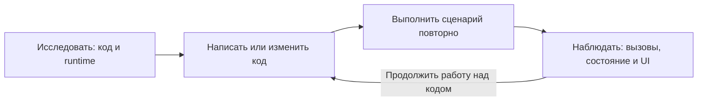

# Mobile Easy Use

**Инструмент для Android- и iOS-разработчиков, предоставляющий ИИ-агентам доступ к runtime для исследования, отладки и автоматизированного UI-тестирования приложений.**

Документация: [English](../README.md) · [简体中文](./README.zh.md) · [Français](./README.fr.md) · **Русский** · [Español](./README.es.md) · [العربية](./README.ar.md)

По сравнению с веб-разработкой получить доступ к внутренним данным, бизнес-состоянию и процессу выполнения мобильного приложения сложнее. **«Запрос выполнился успешно — почему список не обновился?»** Такие проблемы зависят от реальных данных, состояния и порядка выполнения на устройстве, поэтому одного статического анализа исходного кода часто недостаточно.

Mobile Easy Use предоставляет ИИ-агентам доступ к runtime приложения через MCP. Агент может сопоставлять исходный код с реальным поведением, читать объекты и состояние, перехватывать вызовы методов, временно изменять условия выполнения, а также управлять и проверять интерфейс.

https://github.com/user-attachments/assets/e956fdbf-da6a-4608-a877-11a107f70760

## Исследование состояния и поведения приложения



Наблюдения направляют агента на протяжении цикла разработки:

- **Исследование и подготовка**: сопоставить код с вызовами, данными и состоянием работающего приложения, чтобы понять его реальное поведение.
- **Проверка технического решения**: временно изменить настройки, поля или результаты методов в работающем приложении, проверить гипотезы и восстановить значения.
- **Поиск проблемы**: воспроизвести проблему в приложении и связать реальные вызовы, изменения состояния и поведение UI, чтобы найти место сбоя.
- **После изменения кода**: запустить изменённое приложение и повторить сценарий, чтобы проверить фактический результат. Подтверждённые ожидания можно сохранить в регрессионных тестах.

Например, попросите агента:

```text
Исследуй страницу, управляемую флагом конфигурации: проверь настройки
и фактический путь выполнения, временно переключи флаг и проверь данные
и интерфейс в обоих состояниях. Затем восстанови исходное значение.
Оцени решение по результатам наблюдений и укажи, что осталось непроверенным.
```

Агент может исследовать следующую информацию в зависимости от платформы и реализации приложения:

| Информация runtime | Что она показывает |
| --- | --- |
| Бизнес-объекты и состояние | Текущие данные, кэш, конфигурацию и изменения после действия |
| Вызовы методов | Выполненные методы, аргументы, результаты, стеки вызовов и потоки |
| Время выполнения и память | Длительность методов и изменения памяти процесса |
| Бизнес-логи | До какого этапа дошло выполнение и где искать причину сбоя |
| Состояние интерфейса | Наличие, видимость, положение и свойства элементов |
| Снимки экрана | Реальный вид приложения и визуальные изменения после действия |
| Ресурсы приложения | Идентификаторы и содержимое ресурсов Android |
| Результат и контекст сбоя | Этап сбоя, состояние, логи и собранные изображения |

## Также для автоматизированного UI-тестирования

Те же возможности позволяют глубже проверять приложение: нажимать, вводить текст и прокручивать, затем проверять **интерфейс, снимки экрана и внутреннее бизнес-состояние** в одном тесте. После обновления списка можно проверить и отображаемое содержимое, и внутренние данные. Временная подмена поведения помогает подготовить условия, а наблюдения — объяснить сбой.

Сравнение с тестированием, сосредоточенным на UI-действиях и проверках интерфейса:

| Задача | Тестирование через UI | Mobile Easy Use |
| --- | --- | --- |
| Проверить результат | Проверить текст, элементы и снимки | Также проверить нативные объекты, кэш и бизнес-состояние после того же действия |
| Проверить промежуточное состояние | Дождаться видимых изменений | Читать внутреннее состояние и проверять переходы: загрузка, ожидание, завершение |
| Подготовить сценарий | Использовать UI-шаги и доступные данные | Также временно подменять поля или результаты методов для запуска нужной ветви |
| Разобрать сбой | Изучить проверки, снимки и доступные логи | Также сопоставить вызовы, аргументы, результаты и изменения состояния, чтобы объяснить сбой |

### Пример: одно нажатие, три уровня проверки

На исходной странице **UI → Class names and subclasses** в Android ApiDemo нажатие `FIRST` должно установить счётчик в 1 и показать `FIRST:1`. Перед каждым запуском откройте страницу в исходном состоянии и подготовьте проверенный эталонный снимок после нажатия: `baselines/first-clicked.jpg`, путь относительно файла теста.

Полные сценарии с восстановлением состояния есть в [тестах Android](../fixtures/android/ApiDemo/tests/) и [iOS](../fixtures/ios/ApiDemo/tests/). Для сравнения окна используйте `expect().toHaveWindowScreenShot(...)`.

```javascript
const { describe, test, expect, run } = Test.create();
export { run };

describe('Counter button', () => {
  test('updates state, UI, and appearance', async () => {
    const button = R.id.api_ui_class_first;
    const clicked = await AndroidExp.runOnMainThread(() => AndroidExp.input.click(button));
    expect(clicked.ok).toBe(true);

    // Состояние интерфейса
    await expect(button).toBeVisible();
    await expect(button).toSatisfy(view => String(view.getText()) === 'FIRST:1');

    // Снимок экрана
    await expect(button).toHaveElementScreenShot('baselines/first-clicked.jpg');

    // Внутреннее бизнес-состояние
    const count = await AndroidExp.runOnMainThread(() => Java.use(
      'com.agenteasyuse.mobileeasyuse.apidemo.state.ApiDemoState'
    ).getInstance().getClickCount());
    expect(Number(count)).toBe(1);
  });
});
```

## Начало работы

Требуется Node.js 20+. Для Android нужны ADB и устройство или эмулятор. Для iOS нужны macOS, Xcode и инструменты командной строки; для физического устройства также требуются `iproxy` и подпись XCTest Runner.

### 1. Установите Skills

В корне проекта приложения выполните:

```bash
npx skills add agent-easy-use/mobile-easy-use --skill '*'
```

### 2. Интегрируйте Mobile Easy Use

Попросите агента использовать `to-android-integrate` или `to-ios-integrate`. Skill загрузит и проверит артефакты, настроит debug-проект и вернёт совместимую версию MCP. Затем соберите эту версию приложения и установите её на целевое устройство.

### 3. Настройте MCP

Используйте точную версию, которую вернул Integrate (`0.1.0` ниже приведена только как пример):

```json
{
  "mcpServers": {
    "mobile-easy-use": {
      "command": "npx",
      "args": ["-y", "@agent-easy-use/mobile-easy-use@0.1.0"]
    }
  }
}
```

Укажите корень целевого проекта как рабочий каталог MCP, перезагрузите конфигурацию и убедитесь, что доступны `get_sdk_declarations` и `connect`.

### 4. Исследуйте или тестируйте

После сборки и установки интегрированного приложения попросите агента использовать `to-android-probe` или `to-ios-probe` и опишите задачу обычным языком. Probe объединит исходный код, Presets и наблюдения runtime, выполнит исследование и проанализирует доказательства.

Генерируйте тесты через [to-android-test-script](../skills/to-android-test-script/SKILL.md) или [to-ios-test-script](../skills/to-ios-test-script/SKILL.md). Запускайте существующие файлы и получайте сводку через [to-android-test](../skills/to-android-test/SKILL.md) или [to-ios-test](../skills/to-ios-test/SKILL.md).

```text
Создай тесты обновления списка с проверкой UI, снимков и внутренних данных.
Запусти каталог tests и подведи итог: успешные, неуспешные и невыполненные тесты.
```

## Каталог Skills

| Возможность | Когда использовать |
| --- | --- |
| **Observable** | Необязательно улучшить наблюдаемость локальными и минимально инвазивными изменениями |
| **Integrate** | Настроить debug-интеграцию и выбрать совместимую версию MCP |
| **Probe** | Исследовать runtime на естественном языке — от генерации probe до анализа результатов |
| **Test** | Создать файлы по явным ожиданиям, выполнить тесты и подвести итоги |
| **Presets** | Превратить типовые действия и запросы состояния в повторно используемые возможности для Probe и Test |

Полные сценарии описаны в Skills для [Android](../skills/to-android-probe/SKILL.md) и [iOS](../skills/to-ios-probe/SKILL.md).

### Повторное использование возможностей через Presets

Presets объединяет навигацию, бизнес-действия, чтение состояния и временную подмену поведения для Probe и Test. Используйте Skills Presets для [Android](../skills/to-android-presets/SKILL.md) или [iOS](../skills/to-ios-presets/SKILL.md).

`presets.directory` в `.meu/config.json` задаёт базовый каталог: по умолчанию `.meu/presets`, с подкаталогами `android/` и `ios/`. Каждая возможность содержит `index.js` и `index.d.ts`. `presets.entry.js` экспортирует публичные возможности; сборка создаёт `presets.dist.js`, который MCP загружает как `/meu/presets.js` при подключении.

После изменения пересоберите пакет и подключитесь заново. При наличии устройства Skill проверяет возможности запуском; иначе сообщает, что поведение ещё не проверено.

## Источники вдохновения

Mobile Easy Use вдохновлён проектами **quickjs-android**, **xLua** и **Frida**. Frida лежит в основе реализации: встроенный Runtime использует Frida Gadget, а MCP обращается к объектам платформы через мосты Java и Objective-C.

Пакет npm: `@agent-easy-use/mobile-easy-use`.
